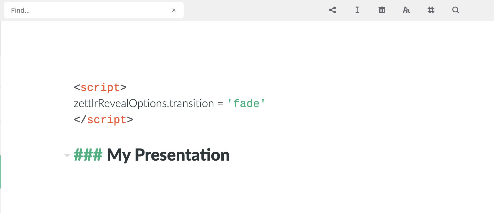
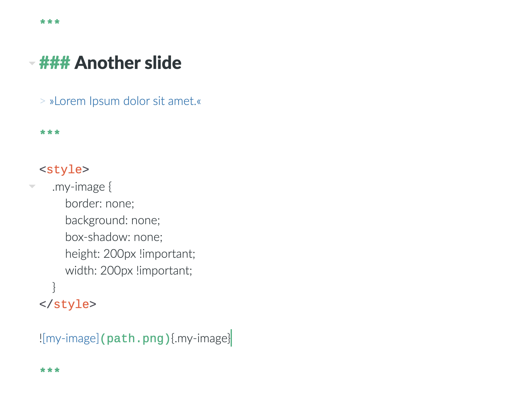

# Presentations

Zettlr is able to export your Markdown files directly as presentation files using the [reveal.js](https://revealjs.com/#/)-framework. `reveal.js` is a lightweight solution for creating presentations using plain HTML and JavaScript. Therefore, these presentations can be shown on _all_ computers that run a browser — nowadays this means: they run on _every_ computer.

For exporting Markdown files to `reveal.js`, you have to make sure Pandoc is installed on your computer. Head over to the [Pandoc setup guide](../installing-pandoc.md) to see how to install pandoc.

## Pre-considerations

Of course, a Markdown document that should be compiled into a presentation has a slightly different structure than other Markdown documents.

### Creating slides

You can create new slides in two ways. First, each heading level 1 will begin a new slide and also act as the title of the slide. But in case the heading level 1 is too big for your taste, or you simply don't want a title on that slide, you can also delimit slides by using Markdown dividers (either `***` or `---`).

Everything that follows the heading or the divider will end up being the content of the slides. You do not have to explicitly "end" the last slide with a divider.

### Using Markdown elements

Inside the slides, you can use all Markdown elements. They will be rendered as you would expect them. You can even use footnotes which will then be placed on their own, respective slide at the end!

### Advanced Tools

Of course, `reveal.js` presentations also have the same versatility as PowerPoint or Impress when it comes to controlling your presentation. For instance, you can use CSS-classes to tell the presentation that certain elements should be triggered before forwarding the presentation. These are called "fragments". Due to limitations in Pandoc's engine, you'll have to use plain HTML to achieve this. Consider, for instance, the HTML code from the demo presentation:

```html
<ul>
    <li class="fragment fade-in">This item will fade in.</li>
    <li class="fragment highlight-blue">This will be highlighted blue.</li>
    <li class="fragment highlight-red">All available transitions are documented [here](https://github.com/hakimel/reveal.js/#fragments).</li>
</ul>
```

This will create a list with three items. All items are "fragments", which means that by pressing the shortcut for the next slide, the first will `fade-in`, as the class says. On the next press of the right arrow key, the second item will be highlighted in blue color. The third press of the right arrow key will highlight the last item red. And on the fourth press of the arrow key the next slide will be shown.

### Presentation settings



Of course, the presentation itself also has settings that you can make use of. These are simple JavaScript directives that you can manipulate by inserting a `<script>`-tag as shown in the screenshot. You can override them by setting the attributes on the `zettlrRevealOptions`-object. These are the options you can set:

```javascript
const zettlrRevealOptions = {
	    // Display controls in the bottom right corner
	    controls: true,
	    // Display a presentation progress bar
    	progress: true,
	    // Display the page number of the current slide
	    slideNumber: true,
	    // Push each slide change to the browser history
    	history: true,
	    // Enable keyboard shortcuts for navigation
	    keyboard: true,
	    // Enable the slide overview mode
    	overview: true,
	    // Vertical centering of slides
	    center: true,
	    // Enables touch navigation on devices with touch input
	    touch: true,
	    // Loop the presentation
    	loop: false,
	    // Change the presentation direction to be RTL
	    rtl: false,
	    // Randomizes the order of slides each time the presentation loads
	    shuffle: false,
	    // Turns fragments on and off globally
	    fragments: true,
	    // Flags if the presentation is running in an embedded mode,
	    // i.e. contained within a limited portion of the screen
	    embedded: false,
	    // Flags if we should show a help overlay when the questionmark
	    // key is pressed
	    help: true,
	    // Flags if speaker notes should be visible to all viewers
	    showNotes: false,
	    // Global override for autolaying embedded media (video/audio/iframe)
	    // - null: Media will only autoplay if data-autoplay is present
	    // - true: All media will autoplay, regardless of individual setting
	    // - false: No media will autoplay, regardless of individual setting
	    autoPlayMedia: null,
	    // Number of milliseconds between automatically proceeding to the
	    // next slide, disabled when set to 0, this value can be overwritten
	    // by using a data-autoslide attribute on your slides
	    autoSlide: 0,
    // Stop auto-sliding after user input
	    autoSlideStoppable: true,
	    // Enable slide navigation via mouse wheel
	    mouseWheel: false,
	    // Hides the address bar on mobile devices
	    hideAddressBar: true,
	    // Opens links in an iframe preview overlay
    	previewLinks: false,
	    // Transition style
	    transition: 'convex', // none/fade/slide/convex/concave/zoom
	    // Transition speed
	    transitionSpeed: 'default', // default/fast/slow
	    // Transition style for full page slide backgrounds
    	backgroundTransition: 'fade', // none/fade/slide/convex/concave/zoom
	    // Number of slides away from the current that are visible
    viewDistance: 3,
    // The display mode that will be used to show slides
    display: 'block'
};
```

### Presentation Styling

If none of the available themes appeal to you, or if you need to provide some extra CSS, you can do so simply by dropping in a `<style>`-tag somewhere in your presentation.

You'll need some knowledge of CSS to finegrain the styling, but the appearance of the presentation itself should be satisfying on its own.



### Images

One of the big drawbacks of such HTML presentations is that images cannot be contained in the resulting file. (To be correct, they _can_ be included, but that would increase the file size by the size of all images multiplied by the factor 1.3.)

So you need to decide where to put the images. There are basically three feasible methods.

1. Create a dedicated directory for the images, e.g. `img`, inside the directory with your markdown file. Then link to all images using relative paths (`img/my-image.jpg`). When you export your file, make sure the presentation is in the same place relative to the image directory as your source file.
2. Simply put all images inside the same directory as your presentation file. Then linking to them using their file name should suffice.
3. Upload them to the web, for instance unto an image hosting service, and link their URLs. Only drawback: You would need to rely on a working internet connection at the place where you hold your presentation.

A rule of thumb is: If Zettlr correctly displays your images, so will your presentation, as long as you make sure the presentation is in _exactly_ the same directory as your source file relative to the images.
