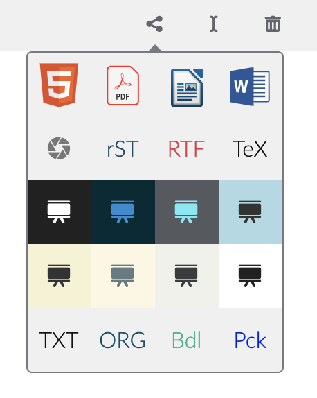

# Exporter dans Zettlr

L'exportation de fichiers est une interface importante entre vos notes et d'autres personnes. Grâce à l'option d'exportation, vous pouvez :

1. Prévisualisez un fichier, par exemple au format HTML, et l'imprimer également. (L'impression d'une note à l'aide de `Cmd/Ctrl+P` exportera la note en interne au format HTML.)
2. L'exporter dans un format avec lequel d'autres personnes peuvent travailler, comme des fichiers Word ou OpenDocument.
3. L'exporter au format PDF pour le soumettre (par exemple, des travaux de séminaire) ou, également, pour l'imprimer.

> Zettlr dépend de Pandoc pour exporter vers autre chose que HTML, et en plus de LaTeX pour exporter vers PDF. Veuillez vous référer aux guides de configuration pour installer [Pandoc](../ installing-pandoc.md) et [LaTeX](../ installing-latex.md) sur votre ordinateur.

## Exporter des fichiers

Il existe deux façons d'exporter des fichiers avec Zettlr: les exportations de fichiers uniques et les exportations de projets. L'exportation d'une seule page se trouve dans la barre d'outils et peut être ouverte avec `Cmd / Ctrl + E`. Cela vous permet d'exporter dans une variété de formats (le nom complet est affiché au survol de la souris). L'icône d'export révèle les différents thèmes disponibles pour l'export revealJS intégré.

La deuxième méthode pour exporter des fichiers consiste à exporter des [projets](../academic/projects.md) entiers. Vous pouvez exporter un projet en cliquant avec le bouton droit sur le répertoire du projet et en choisissant l'option d'exportation.

> Notez que l'exportation au format PDF peut générer des erreurs sous la forme de `fichier <nom> .sty not found`. Celles-ci peuvent être résolues en installant les packages LaTeX manquants. Veuillez consulter, par exemple, [ce guide](https://en.wikibooks.org/wiki/LaTeX/Installing_Extra_Packages) pour savoir comment installer des packages LaTeX supplémentaires.

## Choisir la destination

Zettlr a besoin de savoir où stocker vos fichiers exportés. Deux options s'offrent à vous: les exporter vers votre **répertoire temporaire**, ou vers le **répertoire du fichier**. Chacun a ses avantages et ses inconvénients.

> Vous pouvez définir le [paramètre](../reference/settings.md) correspondant dans l'onglet Exporter.

L'exportation vers le répertoire temporaire vous permet d'exporter un fichier plusieurs fois sans que vous ayez à vous soucier de supprimer à nouveau le fichier par la suite, car votre répertoire temporaire est régulièrement vidé par votre ordinateur. Comme Zettlr ouvre le fichier immédiatement avec l'application par défaut (par exemple, Word pour les fichiers `.docx`), vous pouvez utiliser l'option" Enregistrer sous ..." pour enregistrer le fichier dans un autre emplacement dès que vous êtes satisfait du résultat.

Si vous ne vous inquiétez pas d'avoir des fichiers exportés parmi vos fichiers Markdown, vous pouvez également dire à Zettlr d'enregistrer le fichier dans votre répertoire actuel. Veuillez noter que Zettlr écrasera toujours les fichiers exportés sans demander de confirmation.

## Personnaliser les exports

Les modèles par défaut fournis par Zettlr sont conçus pour donner une bonne première impression tout en étant compatibles, mais à mesure que vous maîtriserez mieux Zettlr, vous souhaiterez peut-être personnaliser la façon dont les fichiers sont mis en page. Il existe un [guide complet sur la création de modèles] (../academic/custom-templates.md) avec Zettlr dans la documentation.