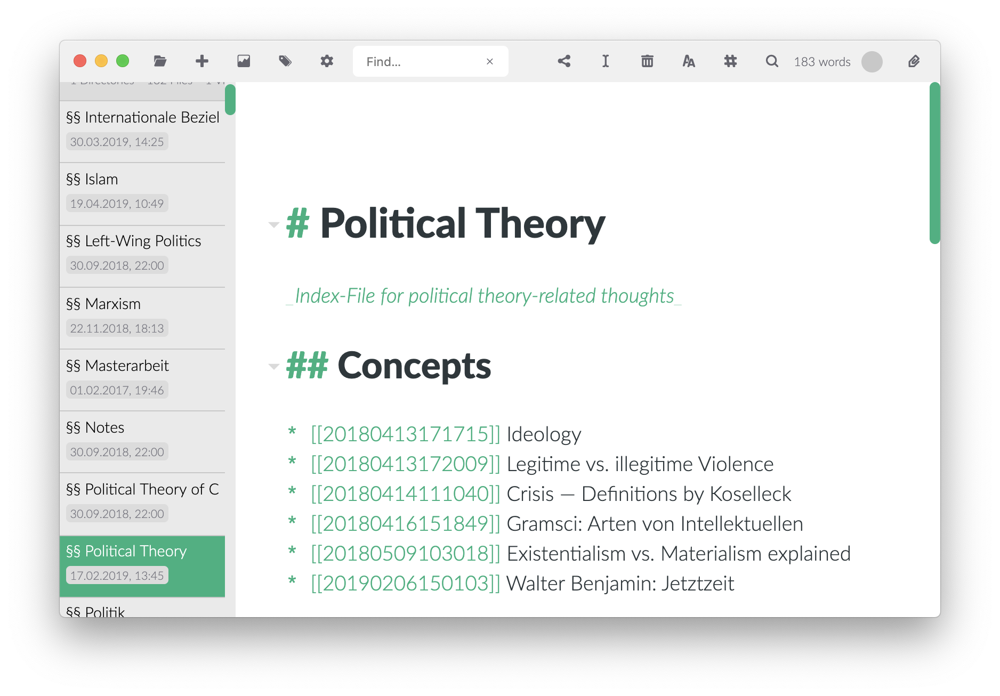

# ガイド: ZettlrをZettelkastenシステムとして使う

Zettlrは、ファイルを整理し、構造化するための多くの機能を備えた、洗練されたZettelkastenシステムとして使うことができます。Zettelkastenを作り始めるには、以下のステップに従ってください。

> このガイドにしたがうと、ZettlrをnvALT、zkn、The Archiveなどの代わりとして使えるように設定できます。

**Zettelkastenという概念は初めてですか？それなら、[上手くいくZettelkastenの仕組みに関する投稿](https://www.zettlr.com/post/what-is-a-zettelkasten)と、[それに付随する動画](https://youtu.be/c5Tst3-zcWI)を見ることをお勧めします。**

## ステップ1: 設定を調整する

Zettelkastenを作り始めるのにまず必要なのは、設定を確認することです。以下の設定で、ZettlrをZettelkastenに適したものに変えることができます。

- 一般タブ
    - ファイル情報を表示: on
    - サイドバー: Thin mode
- スペルチェックタブ
    - すべての辞書をoff
- エクスポートタブ
    - ファイルからZKN IDを取り除く: off
    - 「内部リンクを保持する」を選択
- Zettelkastenタブ
    - Zettelkastenを導入するのに最も重要なタブです。ここでは、ZettlrがZettelkastenとやり取りする方法を設定します。[設定についての章](../reference/settings.md)を読んで、Zettelkastenタブの設定項目についてよく理解してください。

## ステップ2: ディレクトリを作る

ZettlrがZettelkasten機能で使うための基本的な値を設定し終わったら、次にディレクトリを作ります。基本的には、一つの大きなディレクトリにすべてのものを放り込んでいきます、なので、ルートディレクトリがひとつあれば十分です。その後、アプリケーションを開くたびに、すべてのファイルを含む長い一覧が作られて、すぐに作業を始められます。

Zettlrに新しいディレクトリを追加するには、`Cmd/Ctrl+O`を押すか、ツールバーの最初のボタンをクリックするか、ファインダーまたはエクスプローラーからアプリ上にディレクトリをドラッグします。

## ステップ3: 書く

これで、ZettlrをZettelkasten管理システムとして使う準備ができました。Zettelkastenにおいては、次の2つの操作が重要になります。

1. ノート内にIDを記述し、そのノートにリンクを張れるようにしましょう。`Cmd/Ctrl+L`のショートカットを使用すると、生成されたIDを編集中のノートに挿入することができます。
2. 他のノートにリンクを張りましょう。ノートを編集中にリンクの開始(デフォルト`[[`)を入力すると入力補完のためのドロップダウンが表示され、そこからリンクするファイルを選択することができます。

Zettelkastenの機能や見え方について深く掘り下げたい場合は、ウェブ上でZettelkastenに関する膨大なリソースが入手可能です。手始めに、[Zettelkasten.de](https://www.zettelkasten.de/)を見るのが良いでしょう。この作者は、Zettelkastenを使った効率的なライティング方法について、大量の（英語の）ブログを投稿しています。
